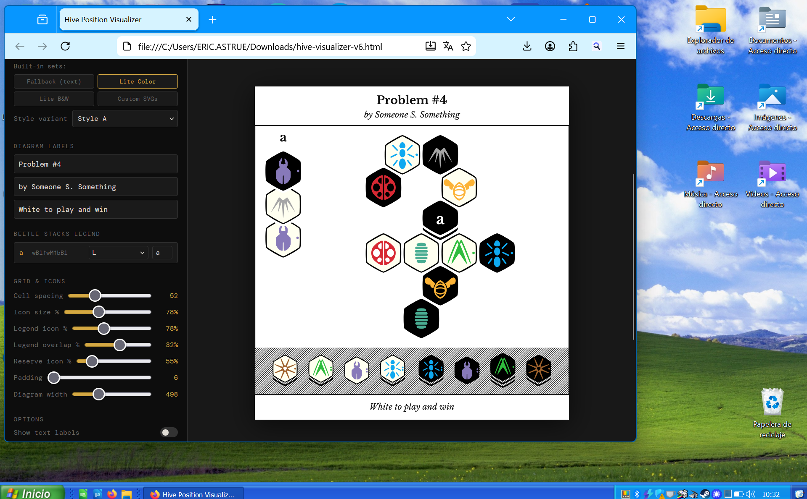
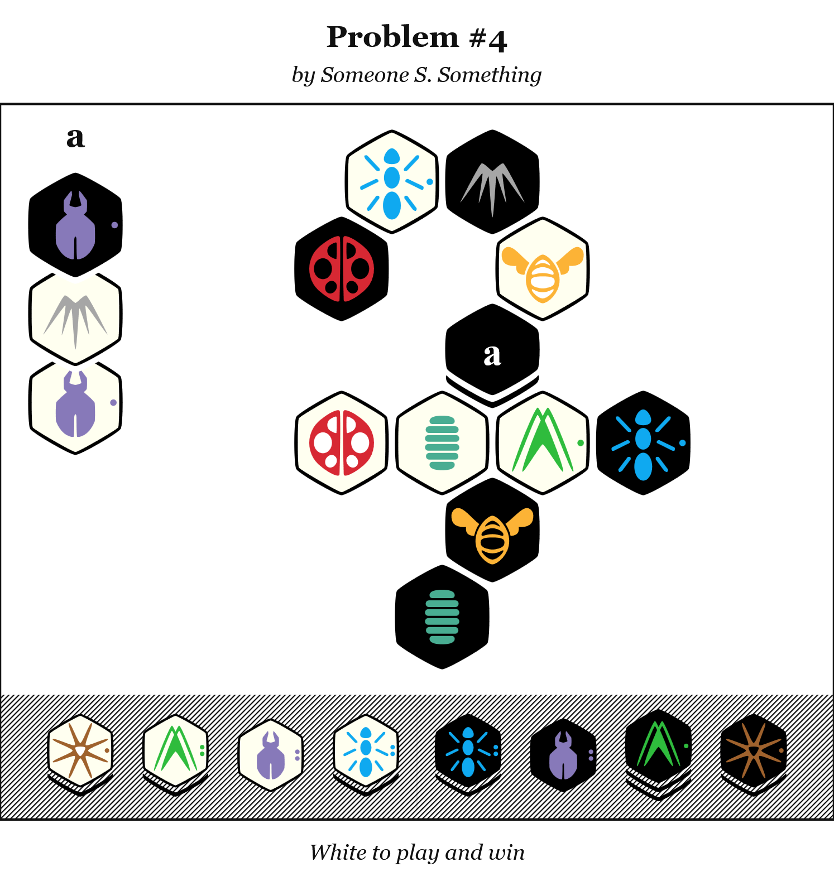
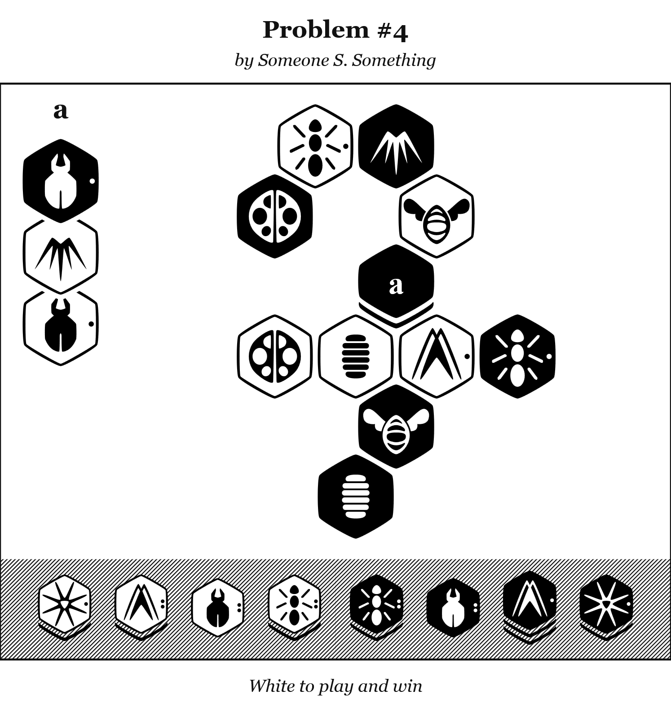

# Hive Print

A browser-based diagram generator for the board game [Hive](https://www.gen42.com/games/hive). Paste a position in UHP notation and get a clean, print-ready SVG or PNG — suitable for puzzles, articles, and tournament materials.



**[→ Try it live](https://erickenneth.github.io/hive-visualizer)**

---

## Features

- **UHP input** — paste any Universal Hive Protocol string directly
- **JSON input** — cube coordinate format also supported (work in progress)
- **SVG & PNG export** — vector output for print, raster for web
- **Two built-in icon sets** — Lite Color and Lite B&W, ready out of the box
- **Custom SVG icons** — drop in your own piece artwork
- **Reserve display** — unplayed pieces shown automatically with stacking indicators
- **Beetle stack legend** — stacked pieces get a labeled legend column
- **Fully adjustable layout** — cell size, icon scale, padding, colors, diagram width
- **Base game + expansions** — M (Mosquito), L (Ladybug), P (Pillbug), D (Dragonfly)


## How to use

1. Open the tool in your browser
2. Paste a UHP string into the input field and click **Render**
3. Add a title, subtitle, and caption if needed
4. Adjust the icon set, size, and colors to taste
5. Export as **SVG** (for print / Illustrator / Inkscape) or **PNG**


### UHP format

```
Base+MLP;InProgress;White[4]
wQ
bQ wQ-
wA1 wQ\
bA1 /bQ
...
```

The header line (`Base`, `Base+M`, `Base+MLP`, etc.) is used to determine which pieces belong in the reserve. Moves follow standard UHP notation.

## Status

Work in progress. Known gaps:

- Header doesn't accept Base+MLPD
- No rotation 
- Json still not supported

Feedback and contributions welcome.

## Examples




## License

MIT © EricKenneth


